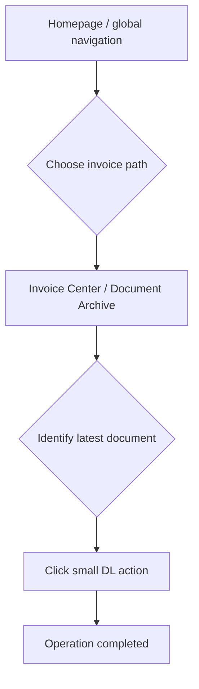
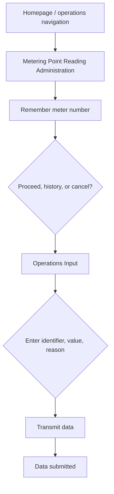
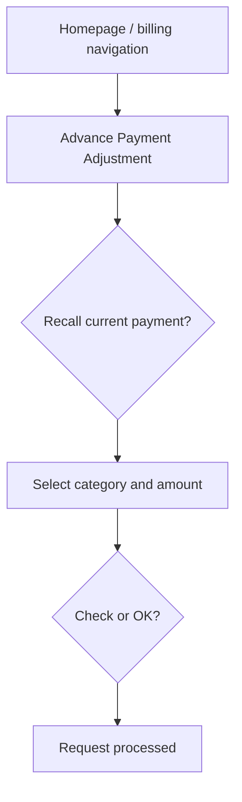
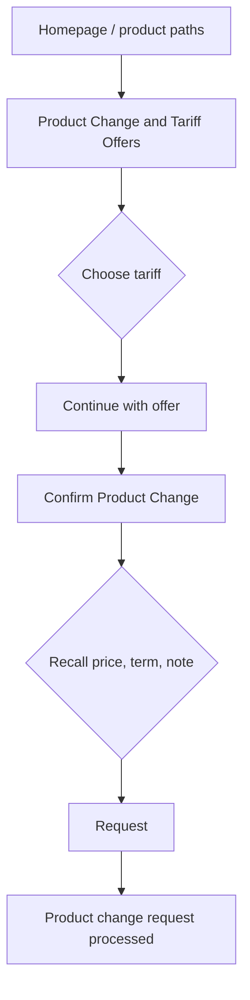
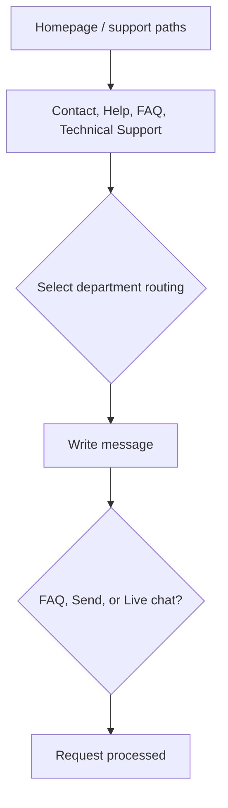

# MyEnergy Legacy Portal UX and Cognitive-Friction Audit

Stage: 2  
Scope: diagnosis of the Stage 1 legacy portal only  
Evidence basis: current interface inspection, source review, and browser walkthrough  
Important limitation: this is not user research. Findings are interface evidence, professional inference, and design hypotheses, not observed user-test results.

## Severity Criteria

| Severity | Criteria |
| --- | --- |
| Critical | Likely to block completion, cause incorrect account or contract action, or create high support dependency for a common task. |
| High | Likely to cause abandonment, significant rework, high uncertainty, or avoidable support contact in a common or commercially important task. |
| Medium | Creates avoidable effort, delay, comprehension risk, or inconsistency, but the task remains reasonably recoverable. |
| Low | Creates localized friction or polish issues with limited direct task impact. |

## Audit Findings

| ID | Interface area | User task affected | Observable problem | UX law or principle | Cognitive explanation | User consequence | Possible business consequence | Severity | Frequency likelihood | Evidence from current interface | Recommended direction | Confidence | Data still needed |
| --- | --- | --- | --- | --- | --- | --- | --- | --- | --- | --- | --- | --- | --- |
| LEG-001 | Global navigation and homepage quick actions | All tasks | The first screen exposes 28 left-navigation items, 9 quick actions, 3 right-rail panels, and table actions with similar visual weight. | Hick's Law; Decision effort; Information architecture; Cognitive load | Users must compare many overlapping alternatives before acting. The interface increases choice search and forces users to infer which label maps to their goal. | First-time and less-confident customers may hesitate, scan repeatedly, or choose a plausible but wrong path. | Common self-service tasks may shift to support channels because the portal does not clearly prioritize them. | High | High for first visits and occasional users; medium for experienced repeat users. | Navigation groups list General, Billing, Operations, and Customer Administration items; quick actions repeat several of the same destinations. | Create a task-prioritized IA with grouped common jobs and progressive disclosure for low-frequency departmental options. | High | Top task frequency, search terms, click-path analytics, and support-contact reasons by task. |
| LEG-002 | Navigation labels | All tasks | Several labels overlap conceptually: Payment, Payment Method, Monthly Payment, Advance Payment Adjustment, Invoice Center, Documents, and Document Archive. | Mental models; Recognition rather than recall; Comprehensibility | Recognition only works when labels are distinct and familiar. Here users must remember or guess internal differences between similar categories. | Customers may bounce between sections to verify where invoices, payment changes, or mandates belong. | Repeated navigation increases abandonment risk and reduces trust in the portal as a reliable service channel. | High | High because these labels are visible on every legacy screen. | The Billing navigation group contains eight choices, many routing to the same payment or document views. | Replace overlapping labels with customer-goal labels, then use secondary links within task pages for related but less common actions. | High | Card sorting or tree testing to validate customer language and grouping. |
| LEG-003 | Meter reading flow | Submit meter reading | The meter number is shown on the first screen, then disappears and must be entered manually on the next screen. | Miller's Rule; Recognition rather than recall; Cognitive load; Error prevention | The flow converts a recognition task into a recall/transcription task. Users must hold an unfamiliar identifier in working memory while moving screens. | Customers can mistype the meter number, go back to retrieve it, or abandon the reading submission. | Invalid readings and support contacts can increase operational handling costs. | Critical | High when customers submit readings through this flow. | Meter step 1 states the number will not be repeated; step 2 asks for Meter number / Consumption Point ID. | Carry the meter number forward, show it next to the input, or prefill it where identity is already known. | High | Error logs for rejected meter identifiers and completion rates by device type. |
| LEG-004 | Meter reading flow actions | Submit meter reading | The first step provides Proceed, Show historical consumption, and Cancel transaction with similar visual treatment and no progress indicator. | Action logic; Hick's Law; Orientation | Users are asked to decide between process actions and secondary exploration before the system has clarified the sequence or expected next state. | Less-confident users may not know whether Proceed submits data, starts a process, or opens another decision screen. | Reading submissions may be delayed or require support clarification. | High | Medium to high during meter-reading periods. | Metering Point Reading Administration has no visible step count and uses generic Proceed wording. | Introduce clear step labels, separate secondary actions, and use verb-specific primary actions such as Continue to reading entry. | High | Observed hesitation points from moderated usability sessions. |
| LEG-005 | Invoice table | Download latest invoice | The download action is a small button labelled DL in the far-right table column, while Filter and archive-like elements compete nearby. | Fitts's Law; Comprehensibility; Recognition rather than recall | The primary action has a small target and uses an abbreviation. Users must scan across a wide table row to connect the file with the action. | Customers may miss the latest invoice download or download the wrong document. | Invoice-related support contacts and repeated document retrieval attempts may increase. | High | High because invoice download is a common returning-customer task. | Invoice Center table places DL buttons in a narrow final column; CSS sets .small-action min-height to 24px and min-width to 30px. | Use explicit Download labels, larger row actions, and place the latest invoice action near the document title. | High | Click heatmaps or support tags for invoice-download confusion. |
| LEG-006 | Completion messages | All tasks | Several completion states use vague status text such as Operation completed, Data submitted, and Request processed. | Feedback and visibility of system status; Comprehensibility; User confidence | Feedback reduces uncertainty only when it names what changed and what happens next. Generic messages do not support verification. | Customers may repeat submissions, contact support, or remain unsure whether account changes took effect. | Duplicate requests and reassurance contacts can create avoidable service load. | Critical | High because every completed core task depends on feedback. | noticeText returns vague strings for invoice, meter, payment, tariff, and support outcomes. | Use task-specific confirmations with the submitted value, effective date, reference number, and next step where relevant. | High | Rates of repeat submissions, post-action support contacts, and customer survey comments after completion. |
| LEG-007 | Monthly payment adjustment | Adjust monthly payment | The current monthly payment is not visible in the payment form, and the form says the current amount is in another account overview area. | Recognition rather than recall; Cognitive load; Decision effort | Users need a baseline to judge a new amount. Removing the current value forces memory, backtracking, or unsupported estimation. | Customers may choose a poor adjustment or leave the form to verify the current amount. | Underpayment risk, overpayment dissatisfaction, and billing-support contacts may increase. | High | Medium; high for customers responding to billing changes. | Payment view text states current balance and current amount are shown elsewhere; the editable value defaults to 172 while overview shows EUR 148. | Show current monthly payment, balance, recommended range, and projected impact beside the adjustment control. | High | Distribution of payment changes, rejected values, and support contacts after adjustment attempts. |
| LEG-008 | Monthly payment adjustment actions | Adjust monthly payment | The primary submit action is labelled OK, and a separate Check button appears beside it without explaining the difference. | Action logic; Consistency; Comprehensibility | Ambiguous verbs make users infer system behavior. OK does not reveal whether the action previews, saves, or submits a binding request. | Customers may avoid submitting or may submit before understanding the consequence. | Ambiguous financial changes can reduce digital trust and increase support demand. | High | Medium. | Payment form action row contains Check and OK buttons after financial input fields. | Use explicit action labels such as Review new monthly payment and Submit payment change. | High | Task recordings showing whether users pause or misinterpret the Check and OK actions. |
| LEG-009 | Tariff change confirmation | Change tariff | The comparison details disappear on the confirmation screen, so selected price, term, and offer note are not visible at the decision point. | Memory load; Decision effort; Error prevention; Feedback | The confirmation step asks users to commit while withholding the evidence they used to decide. This increases reliance on memory. | Customers may go back to re-check terms or submit a tariff change with lower confidence. | Tariff changes can generate cancellations, complaints, or support contacts if customers later question the selected terms. | Critical | Medium; high among customers considering tariff changes. | Tariff step 2 explicitly states price and term information is no longer displayed. | Carry selected tariff name, price, term, effective date, and key constraints into the confirmation step. | High | Drop-off between comparison and confirmation, plus cancellation or reversal reasons. |
| LEG-010 | Support request routing | Request customer support | Support topics are organized by departments and internal concepts rather than customer problems. | Mental models; Information architecture; Comprehensibility | Customers usually think in problems, not departments. Department routing requires organizational knowledge that many users lack. | Requests may be misrouted or users may choose broad contact paths because they cannot classify the issue. | Misrouting increases handling time and first-contact resolution risk. | High | High for support tasks. | Routing options include Billing service request, Operations metering point issue, Contract Management, and Technical Support. | Start from customer issue categories and map to internal routing behind the interface. | Medium | Contact reason taxonomy, routing accuracy, transfer rates, and failed contact-form submissions. |
| LEG-011 | Mobile navigation | All tasks on mobile | On small screens the legacy navigation remains dense, with departmental groups and two-column lists before the task content. | Fitts's Law; Cognitive load; Orientation; Accessibility | Mobile users face reduced visual span and higher scrolling cost. Dense lists increase scanning time and make target separation more demanding. | Digitally less-confident mobile customers may need excessive scrolling and may tap adjacent items by mistake. | Mobile self-service completion may lag desktop, pushing customers to phone support. | High | High if a substantial share of customers use mobile devices. | CSS changes navigation to two columns below 680px but preserves all visible navigation items. | Prioritize mobile top tasks, collapse secondary navigation, and maintain larger separated targets for primary actions. | Medium | Device mix, mobile completion rate, tap-error indicators, and mobile support-call attribution. |
| LEG-012 | Overview screen | All tasks | The overview mixes account facts, document history, operations status, product offers, balance, campaign, and help panels at once. | Orientation; Cognitive load; Information architecture | A useful overview should establish where the user is and what matters now. Mixed departmental objects create competing interpretation frames. | Users may struggle to determine what needs attention versus what is promotional or archival. | Important actions may be missed while low-value content receives equal attention. | Medium | High on entry to the portal. | The overview shows dense facts, a transaction table, quick actions, and right-rail campaign/balance/help panels. | Separate urgent account tasks from promotions and archival information; use clear status hierarchy. | High | Top entry-page tasks, scroll behavior, and click distribution from the overview. |
| LEG-013 | Terminology across flows | All tasks | The portal alternates between customer-friendly labels and internal terms such as Product Change, Metering Point, Contract Object, and Advance Payment Adjustment. | Consistency; Comprehensibility; Mental models | Mixed vocabulary prevents stable recognition. Users must continually translate between plain language and company language. | New customers and less-confident users may feel the portal is not intended for them. | Low confidence can reduce adoption of self-service for high-value tasks. | Medium | High across the portal. | Quick actions use phrases like Submit meter reading, while page headings use Metering Point Reading Administration and Operations Input. | Create a controlled vocabulary based on customer goals, with legal or technical terms explained only where necessary. | High | Comprehension testing for key labels and multilingual/legal terminology constraints. |
| LEG-014 | Validation and error messages | Meter, payment, support | Errors state that data was not accepted or mandatory data is incomplete, but they do not show examples or recovery guidance. | Error prevention; Feedback; Comprehensibility | Error recovery requires knowing what was wrong, where it happened, and how to fix it. Generic errors preserve uncertainty. | Users may repeatedly edit fields without understanding the expected format or value range. | Failed submissions can increase abandonment and downstream support contacts. | Medium | Medium; higher when users mistype identifiers or financial values. | Meter error says Metering identifier was not accepted; payment error says Value outside configurable range. | Add inline examples, accepted ranges, format hints, and field-specific recovery text before and after errors. | High | Validation failure counts by field and message-level recovery success. |
| LEG-015 | Right rail service and promotion panel | Payment, tariff, support | Campaign, balance, and help panels remain visually adjacent to core tasks and introduce generic actions such as More and Action. | Decision effort; Fitts's Law; Consistency | Persistent secondary panels compete with task focus and provide action labels that require interpretation. | Customers can be diverted from a task or misinterpret a side action as related to the current form. | Task abandonment can rise when stakeholder content interrupts self-service intent. | Medium | Medium to high on desktop layouts. | The right aside includes Campaign Center, Open Balance, and Need Help? with More, Action, Live Chat, and Contact form buttons. | Contextualize secondary actions by task, suppress promotional content during transactional flows, and use explicit labels. | Medium | Click attribution for right-rail actions during task flows and stakeholder content-performance targets. |

## Quantitative Proxy Analysis

Counting method:

- Visible homepage options count includes 28 left-navigation buttons, 9 quick-action buttons, 3 right-rail panels/actions, and 3 overview table actions. This produces 43 visible options. It is an exact interface count for the current implementation, but it is not a performance metric.
- Competing calls to action count includes interactive elements visible near the task entry and task surface. It is exact for visible controls on the inspected screens, but interpretation of "competing" is a professional approximation.
- Steps are counted as visible task states required from entry point to completion.
- Decisions are approximate cognitive choice points, not measured user behavior.
- Fields are exact count of inputs/selects/textareas required or exposed in the implemented form.
- Memory items are approximate count of task-critical facts not visible at the decision point.
- Target dimensions are determinable where CSS defines minimums; actual rendered sizes vary by content and viewport.
- Terminology changes are approximate counts of meaningfully different labels or internal terms encountered in the task path.

| Task | Visible homepage options | Competing CTAs | Steps | Approx. decisions | Fields | Memory items | Progress feedback | Completion feedback | Approx. target dimensions | Terminology changes |
| --- | ---: | ---: | ---: | ---: | ---: | ---: | --- | --- | --- | ---: |
| Download latest invoice | 43 | 16 | 2 | 4 | 0 | 0 | Absent | Vague | DL button min 30px wide x 24px high; table row actions require horizontal association. | 4 |
| Submit meter reading | 43 | 16 | 3 | 7 | 3 | 1 | Absent | Vague | Navigation min 28px high desktop, 30px mobile; process buttons min 32px high. | 6 |
| Adjust monthly payment | 43 | 16 | 2 | 6 | 4 | 1 | Absent | Vague | OK and Check buttons use generic small process styling with 32px minimum height. | 6 |
| Change tariff | 43 | 16 | 3 | 8 | 3 | 3 | Absent | Vague | Radio rows are visually larger, but final Request action uses generic 32px process button styling. | 7 |
| Request customer support | 43 | 18 | 2 | 6 | 2 | 0 | Absent | Vague | Chat shortcut min 30px x 24px; FAQ, Send, and Live chat actions min 32px high and closely grouped. | 5 |

## Task-Flow Analysis

### 1. Download Latest Invoice

Entry point: quick action "Download latest invoice", navigation "Invoice Center", navigation "Documents", navigation "Document Archive", or overview table "Open".  
Steps: choose an entry point; scan invoice table; select DL in the latest invoice row.  
Decisions: distinguish invoice from documents/archive; identify latest row by posting date; interpret DL abbreviation.  
Memory requirements: none required, but row association must be maintained while scanning across the table.  
Potential error points: selecting an older invoice; missing the small DL target; interpreting Filter or Archive as the route.  
Feedback points: status banner says "Operation completed".  
Exit or completion state: user remains in Invoice Center with vague completion status.  
Primary UX laws involved: Fitts's Law, Hick's Law, recognition rather than recall, feedback visibility.

### 2. Submit Meter Reading

Entry point: quick action "Submit meter reading", navigation "Meter", navigation "Meter Reading", or overview table "Input".  
Steps: choose entry point; read meter number on first screen; proceed; enter meter number, current register value, and reading reason; transmit data.  
Decisions: distinguish Meter, Meter Reading, Consumption, Consumption Point; decide whether Proceed, historical consumption, or cancel is appropriate; select reading reason.  
Memory requirements: meter number must be remembered or copied from the previous screen.  
Potential error points: mistyped meter number; wrong identifier type; implausible reading value; selecting an unexpected reading reason.  
Feedback points: inline errors; status banner says "Data submitted".  
Exit or completion state: user returns to initial meter step with vague completion status.  
Primary UX laws involved: Miller's Rule, recognition rather than recall, action logic, error prevention.

### 3. Adjust Monthly Payment

Entry point: quick action "Adjust monthly payment", navigation "Payment", "Monthly Payment", "Advance Payment Adjustment", "SEPA Mandate Administration", or right-rail "Action".  
Steps: choose entry point; select adjustment category, amount, effective month, mandate usage; submit OK.  
Decisions: distinguish payment labels; decide new amount without visible current baseline; interpret Check vs OK; choose mandate option.  
Memory requirements: current monthly payment and balance must be remembered from overview or side panel.  
Potential error points: entering unsuitable amount; misunderstanding OK as preview; choosing mandate option unrelated to desired task.  
Feedback points: inline range error; status banner says "Request processed".  
Exit or completion state: user remains in payment form without clear effective date or confirmation details.  
Primary UX laws involved: recognition rather than recall, cognitive load, action logic, feedback visibility.

### 4. Change Tariff

Entry point: quick action "Compare product change options", navigation "Tariffs", "Offers", "Energy Products", "Change Contract", or right-rail campaign "More".  
Steps: choose entry point; select a tariff radio option; continue; confirm contract object and legal acceptance; request change.  
Decisions: distinguish tariff/offer/product/change contract labels; compare price and term; decide whether campaign terms or consumption comparison are needed; accept legal declaration.  
Memory requirements: selected tariff price, term, and note disappear before confirmation.  
Potential error points: confirming without visible tariff details; choosing current product; misunderstanding legal acceptance options.  
Feedback points: inline selection error; status banner says "Product change request processed".  
Exit or completion state: user returns to first tariff step with limited confirmation detail.  
Primary UX laws involved: Hick's Law, memory load, decision effort, error prevention.

### 5. Request Customer Support

Entry point: quick action "Request customer support", navigation "Contact", "Help", "FAQ", "Live Chat", "Technical Support", or right-rail help buttons.  
Steps: choose entry point; choose routing area; enter message; send.  
Decisions: choose among many contact/help/chat/FAQ labels; classify problem by department; decide whether FAQ, Send, or Live chat is the right next action.  
Memory requirements: none explicit, but users must map their problem to internal routing categories.  
Potential error points: misrouting; message too short; using FAQ or chat when intending to submit form.  
Feedback points: inline validation error; status banner says "Request processed".  
Exit or completion state: form clears with vague completion status and no reference number or next response expectation.  
Primary UX laws involved: mental models, information architecture, comprehensibility, feedback visibility.

## Management Interpretation

### Five Most Serious Problems

1. LEG-003: Meter number recall requirement in the meter-reading flow.
2. LEG-006: Vague completion messages across core tasks.
3. LEG-009: Tariff comparison details disappear at confirmation.
4. LEG-001: Excessive visible choices on the first screen.
5. LEG-005: Small abbreviated invoice download action.

### Three Highest-Risk Assumptions

1. Customers understand internal energy terms such as Contract Object, Consumption Point, and Metering Point well enough to navigate without explanation.
2. Generic completion messages are sufficient for confidence in billing, metering, support, and contract-change actions.
3. Keeping departmental and promotional content visible during transactional tasks does not materially reduce completion.

### Problems That Can Be Improved Without a Major Technical Relaunch

- Rename ambiguous action labels and navigation labels using customer-goal language.
- Carry forward key values in flows, such as meter number, current monthly payment, and selected tariff details.
- Replace generic completion messages with task-specific confirmation and next-step information.
- Reduce visible priority of right-rail promotions during transactional forms.
- Add clearer inline validation hints and examples.

### Problems That Require Research Before a Confident Solution

- Final navigation grouping and vocabulary should be validated with tree testing or card sorting.
- Mobile prioritization needs device mix, completion, and support-contact data.
- Tariff-change simplification should be informed by legal constraints, user comprehension testing, and cancellation reasons.
- Support routing labels should be validated against actual contact taxonomy and transfer rates.

### Management Statement

Cognitive friction is an economic and organizational risk because it converts solvable digital tasks into hesitation, errors, repeated submissions, and support demand. In the legacy portal, the issue is not only visual design quality; it is decision architecture. Departmental priorities, legal wording, finance needs, marketing visibility, and engineering constraints all surface simultaneously in the customer interface. Management therefore owns part of the UX problem: prioritization, governance, vocabulary, and feedback standards must be treated as operating decisions, not cosmetic preferences.
